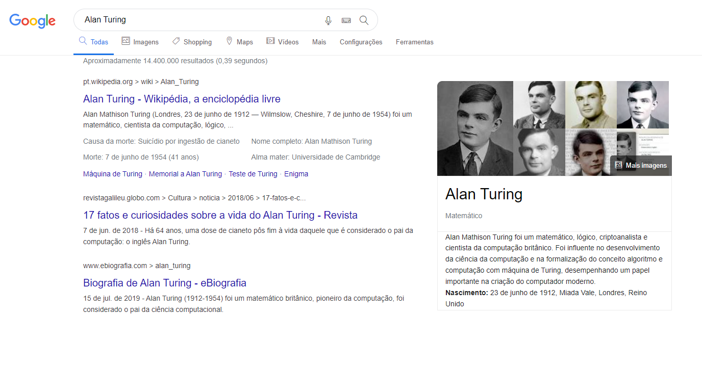

<div align="center">
  <h1>Google Single Page</h1>
  <p>Clone de uma pagina resultados de busca do Google, desenvolvida para estudos sobre as propriedade de CSS display, flexbox, position.</p>
  
</div>

# 📒 Índice
* [Descrição](#descrição)
* [Requisitos Funcionais](#requisitos)
* [Tecnologias](#tecnologias)
* [Design](#design)
  * [Cores](#cores)
  * [Fontes](#fontes)
  * [Ícones](#ícones)
* [Instalação](#instalação)
* [Licença](#licença)

# 📃 <span id="descrição">Descrição</span>
Clone de uma pagina resultados de busca do Google, desenvolvida para estudos sobre as propriedade de CSS display, flexbox, position e utilizando o pacote ícones [**Linearicons**](https://linearicons.com/).

# 📌 <span id="requisitos">Requisitos Funcionais</span>
- [x] Responsividade<br>

# 💻 <span id="tecnologias">Tecnologias</span>
- **HTML**
- **CSS**

# 🎨 <span id="design">Design</span>
- O modelo final para versão desktop e mobile está disponível na pasta `./design`

- <span id="cores">Cores<br></span>
  * #1A0BAD<br>
  * #EBEBEB<br>
  * #DFE1E5<br>
  * #5F6368<br>
  * #1A73E8<br>
  * #70757A<br>
  * #3C4043<br>

- <span id="fontes">Fontes<br></span>
  * Helvetica, Arial, sans-serif

- <span id="ícones">Ícones<br></span>
  * Linearicons

# 🚀 <span id="instalação">Instalação</span>
```bash
  # Clone este repositório:
  $ git clone https://github.com/CleilsonAndrade/google_single_page.git
  $ cd ./google_single_page
```

# 📝 <span id="licença">Licença</span>
Esse projeto está sob a licença MIT. Veja o arquivo [LICENSE](LICENSE) para mais detalhes.

---

<p align="center">
  Feito com 💜 by CleilsonAndrade
</p>